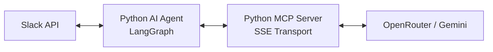

# Cline-Hack: System Architecture

This project implements a modular, AI-driven Slack assistant that utilizes the **Model Context Protocol (MCP)** and **LangGraph** for autonomous reasoning and text simplification.

## 🏗️ High-Level Architecture

The system is designed with a decoupled architecture, separating the "Reasoning Brain" from the "Tool Registry."



### 1. Python AI Agent (The Brain)
- **Framework:** LangGraph / LangChain.
- **Responsibility:** 
    - Orchestrates the reasoning loop.
    - Manages stateful conversations (memory).
    - Interacts with the Slack API for receiving events and posting responses.
    - Connects to the MCP server as a client.

### 2. Python MCP Server (The Tools)
- **Protocol:** Model Context Protocol (MCP) via SSE.
- **Tools Provided:**
    - `simplify_text`: Rewrites technical content for a specific audience.
    - `validate_accuracy`: Ensures factual consistency between source and simplified text.
- **Integration:** Directly interacts with OpenRouter to leverage Gemini 1.5 Pro/Flash.

## 🛠️ Components

### Audience-Aware Pipeline
The system doesn't just rewrite text; it follows a cognitive process:
1.  **Intent Parsing:** Determines the target persona (Management, Engineering, etc.) and specific refinement goals.
2.  **Tool Execution:** The Agent calls the MCP server's `simplify_text` tool.
3.  **Verification Loop:** The Agent validates the output using the `validate_accuracy` tool. If accuracy is lost, the agent re-executes the simplification with corrective feedback.

### State Management
- Session context is maintained to allow for iterative refinements (e.g., "now make it even shorter").
- LangGraph ensures that the agent remembers the previous version of the text and the audience context.

## 📂 Project Structure

```text
Cline-Hack/
├── python-ai-agent/         # LangGraph Reasoning Engine
│   ├── agent.py             # Main entry point and logic
│   └── .env.example         # Environment template
├── python-mcp-server/       # Tool Server
│   ├── server.py            # MCP server implementation
│   └── .env.example         # Environment template
├── README.md                # General setup and overview
└── ARCHITECTURE.md          # Technical documentation
```

## 🔐 Security & Reliability
- **Signature Verification:** Validates Slack requests to ensure they originate from the correct workspace.
- **Asynchronous Delivery:** Uses Slack's `response_url` to prevent timeouts during long LLM generations.
- **Error Resilience:** Graceful fallbacks for API failures or invalid input formats.
